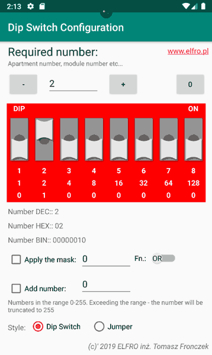

# DIPSwitch
Android DIP Switch Configurator

Program for Android phones. Build in Android Studio.

Its task is to help you set jumpers in many devices. For example, module address in extension unit. 

The program is very simple. After starting it, the following window will appear:
 
  

Enter the number (address) from 0 to 255 which the program converts to the appropriate jumper configuration. You can choose the style of the jumper - as a dip switch or jumper.

By clicking on the appropriate switches, you can also change the state - as well as the set number. Under the dip switch, the obtained number (address) is written in DEC, HEX and Binary formats.
 
<h3>APPLY A MASK</h3>
Sometimes it is necessary that some jumpers are always 1 or always 0 regardless of the configured number. For this purpose, we use a mask.
The mask can be of the OR type - when some switch or switches must be set to 1. The AND type mask is used to force the setting to 0.

 
<h3>ADD A NUMBER</h3>
Adding a number is easier to understand than a mask. E.g. installation of a digital intercom in a block of flats. In the selected frame there are numbers from 1 to 10, but due to the programmed system, e.g. support for multiple blocks, etc., numbers from 100 must be programmed physically.

Both options are independent. They can also be used together. In the case type, however, the application of the mask takes precedence over the added number. The number is added first, then the mask is applied to it.
